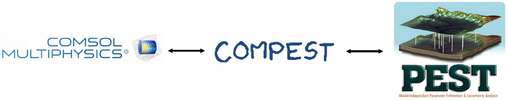

# COMPEST

An interface connecting COMSOL Multiphysics and PEST to solve inverse modelling problems using forward finite element models. 

## The paper
Halloran et al. (2019), _Computers and Geosciences_. 

## Author and contact
Written by Dr. Landon J.S. Halloran, 2018. www.ljsh.ca

## Overview
COMPEST is a program written in _java_ that enables advanced parameter estimation, sensitivity analysis, uncertainty analysis, and data-worth analysis to investigate and solve inverse problems using forward finite-element models. The software functions as a link between [PEST](http://www.pesthomepage.org/) and [COMSOL Multiphysics](http://www.comsol.com). Although the software's functionality has been demonstarted with application to isotopic fractionation in the diffusion and degradation of chlorinated contaminants in the subsurface, any problem that can be modelled in COMSOL Multiphysics can be handled with some modification of the code.

## Requirements
* _(proprietary)_ COMSOL Multiphysics Server (tested with ver. 5.3) and COMSOL Java API
* _(free)_ Java IDE (tested with ver. 1.8), 
* _(free)_ PEST (ver. 12.1.0 executable included here)

## How-to:
* Firstly, it is recommended you read the article: (Halloran et al., 2019).
* Secondly, it is recommended to have some basic familiarity with PEST (see Doherty, 2016).

1. **Define:**
   1. Define problem for which observations (measurements) exist and for which a finite-element model can be created.
   1. Choose which parameters to vary (e.g., to be estimated, to investigate uncertainty, etc.)
1. **Prepare COMSOL Model:**
   1. Set up time-dependent model in COMSOL. (Note: stationary models may work too, but this will require some creativity on your part).
   1. Ensure all parameters to be varied are defined as global "variables" (i.e. not "parameters").
   1. Set model output times to the times of the observations.
   1. In `Results>Data Sets` set the observation points using `Cut Point 1D` or similar. Set the `Point Number Variable` to `cpt1` (alternatively `COMPEST.java` will need to be modified and recompiled).
   1. Delete the values of parameters to be varied (having them present can result in a duplicate definition error).
   1. Launch the COMSOL Server in a separate command prompt using `"C:\XXXXXX\COMSOL53\Multiphysics\bin\win64\comsolmphserver.exe" -multi on` where `XXXXXX` is the location of your COMSOL installation.
1. **Prepare PEST:**
   1. Prepare `.tpl` file. This file tells PEST how to write parameter values to a `.inp` file during execution - this `.inp` file is read by COMPEST.
   1. Prepare your observations/measurements and their corresponding outputs from the model.
   1. Prepare `.ins` file(s), one file for each modelled observation output type. These files tell PEST how to read model output data in `.dat` (or other) files written by COMPEST.
   1. Prepare `.bat` file with line to execute COMPEST (see **Useful Commands** below).
   1. Prepare `.pst` (PEST control file) file. There are utility programs (see Doherty 2016) that are are useful for this.
1. **Prepare COMPEST:**
    1. If needed (e.g., COMSOL Java API plugins not in same location as mentioned in **Useful Commands** below), compile the java _class_ file using `javac -cp "C:\XXXXXX\COMSOL53\Multiphysics\plugins\*" COMPEST.java` where `XXXXXX` is the location of your COMSOL installation.
   1. Define all parametes in the `define.properties` file (an explanation of all parameters is contained in the file header).
   1. Ensure batch file is referring to correct location of COMSOL Java API files (see **Useful Commands** below). 
1. **Final prep and checks:**
   1. (optional) Run utility program `PESTCHEK` to check if `.pst` file has been set up properly.
   1. (optional) Run the .pst file once to calculate the Jacobian with the initial values. Then run the utility program `PWTADJ1` to adjust the weights of each obervation group.
1. **Make it happen:**
   1. Execute the PEST-COMPEST-COMSOL by typing `PEST PCFFILENAME` in the command prompt, where `PCFFILENAME` is the name of the `.pst` "PEST Control File".

## Examples
Four examples are presented in their own stand-alone folders. The first three are discussed in the main article (Halloran et al., see "References" below) and the fourth is presented in the article's Supplementary Information document.

## Useful commands (in Windows cmd):
To compile COMPEST (run in the project directory):\
`javac -cp "C:\Program Files\COMSOL\COMSOL53\Multiphysics\plugins\*" -verbose COMPEST.java`

To execute COMPEST:\
`java -cp .;"C:\Program Files\COMSOL\COMSOL53\Multiphysics\plugins\*" COMPEST`

To launch COMSOL server so that it doesn't close upon disconnect:\
`"C:\Program Files\COMSOL\COMSOL53\Multiphysics\bin\win64\comsolmphserver.exe" -multi on`

_Replace the paths with the locations of your COMSOL java API files or server executable where necessary._

## References:
* Doherty, J. (2016). PEST Model-Independent Parameter Estimation User Manual Part I: PEST, SENSAN and Global Optimisers (6th ed.). Brisbane: Watermark Numerical Computing.
* Halloran, L.J.S., P. Brunner, & D. Hunkeler (2019). "COMPEST, a PEST-COMSOL interface for inverse multiphysics modelling: Development and application to isotopic fractionation of groundwater contaminants," _Computers and Geosciences_.
